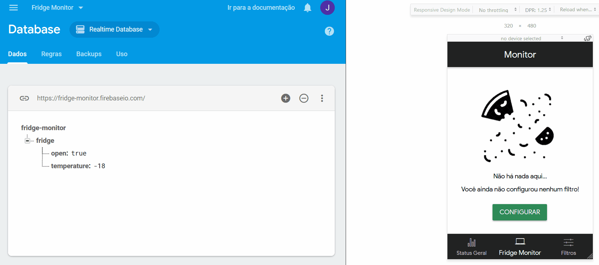

# Fridge Monitor
[](https://www.codacy.com/app/jcezarms/fridge-monitor?utm_source=github.com&amp;utm_medium=referral&amp;utm_content=jcezarms/fridge-monitor&amp;utm_campaign=Badge_Grade)

# Motivation
Fridge Monitor is a proof-of-concept app meant to stand as an example of how straightforward and accessible can fridge management be. It was part of a larger set of projects presented at a brazilian federal university - UFABC - thus it's justified that the only supported language is Portuguese.

This is, in scope and implementation, an experiment, even though minimally functional.

# Usage
If you want to take a closer look at how the project works, feel free to do the following:

## Create a project on Firebase
Fridge Monitor uses Firebase Realtime Database to store its data. Among the many advantages it offers, the main ones noticed were speed and low cost - actually, no cost at all.

Go to [Firebase](https://firebase.google.com/) and create a new project. Create a database and store your keys in ``src/config/firebase.ts`` (the path is on .gitigore), following the format:
```typescript
export const keys = {
    apiKey: "...",
    authDomain: "...",
    databaseURL: "...",
    projectId: "...",
    storageBucket: "...",
    messagingSenderId: "..."
}
```
> Note: Firebase Auth is currently not supported, so the app won't work if you enable it on your database.

## Clone & run
```bash
git clone https://github.com/jcezarms/fridge-monitor.git.git
cd fridge-monitor
npm i
ionic serve -c
```
> Note: to test on a smartphone, either connect to [the Ionic DevApp](https://ionicframework.com/docs/pro/devapp/) or switch the last command with ``ionic cordova build <platform> --prod --release``, and install the generated executable.

If everything is properly setup, your test is going to look like this:

